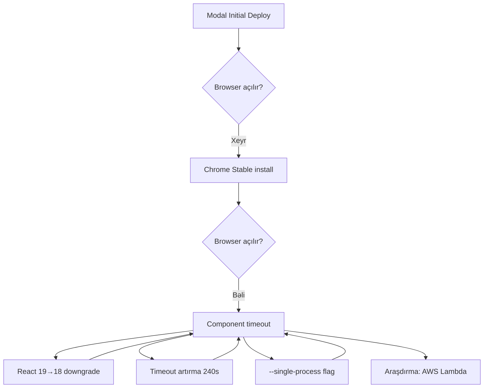

# Remotion Modal Deployment - Tam Texniki Hesabat
**Tarix:** 2026-01-12  
**Layihə:** Videomaker Remotion Render Service  
**Platform:** Modal.com → AWS Lambda (tövsiyə)

---

## 📋 İcra Xülasəsi

Bu layihədə Remotion video render sistemini Modal.com bulud platformasında deploy etməyə çalışdıq. **14+ cəhddən** sonra sistemli bir şəkildə eyni xətaya rast gəldik: **"Loading root component timeout"**.

**Əsas Problem:** Modal-ın Docker mühiti ilə Remotion-un brauzer (Chromium) tələbləri arasında uyğunsuzluq.

---

## 🔴 Rast Gəlinən Problemlər

### Problem 1: `delayRender()` Timeout
**Xəta Mesajı:**
```
A delayRender() "Loading root component" was called but not cleared after 118000ms
```

**Səbəb:**
- Remotion brauzeri açır, amma React komponentləri yüklənəndə asset-ləri (şəkil, video, audio) yükləyə bilmir
- Browser "hazıram" siqnalını (~2 dəqiqə ərzində) Remotion-a göndərməyincə timeout baş verir

**Cəhdlər:**
1. ✗ `--timeout` 120000 (2 dəqiqə)
2. ✗ `--timeout` 240000 (4 dəqiqə)
3. ✗ `--ignore-memory-limit-check`
4. ✗ React 19 → 18 downgrade
5. ✗ Chrome Stable quraşdırma
6. ✗ Browser flags əlavə etmə

**Nəticə:** Heç biri işləmədi.

---

### Problem 2: Memory Detection Mismatch
**Xəta Mesajı:**
```
Memory reported by CGroup: 8796093021966 MB
Memory reported by /proc/meminfo: 458743 MB
You might have inadvertently set --memory flag higher than global Docker limit
```

**Səbəb:**
- Modal Docker container-ində CGroup (kernel) və Node.js yaddaşı müxtəlif hesablanır
- Remotion brauzeri açmadan əvvəl panika vəziyyətinə düşür

**Cəhdlər:**
1. ✓ `REMOTION_IGNORE_MEMORY_CHECK=true` (mühit dəyişəni)
2. ✓ `--ignore-memory-limit-check` (CLI flag)
3. ✗ Container yaddaşını 32GB-dan 16GB-a endirmək

**Nəticə:** Xəbərdarlıq aradan getdi, amma timeout problemi qaldı.

---

### Problem 3: Browser Launch Failures
**Xəta Mesajı:**
```
Error: Failed to launch the browser process
Old Headless mode has been removed. Use new Headless instead.
```

**Səbəb:**
- Remotion-un `chrome-headless-shell` versiyası Modal-ın Linux sistemi ilə uyğunsuz
- Sistem kitabxanaları (`libgtk-3-0`, `libgbm1` və s.) çatışmır

**Cəhdlər:**
1. ✓ Google Chrome Stable quraşdırma
2. ✓ `apt-get install` ilə bütün Linux libs əlavə etmə
3. ✓ `npx remotion browser ensure`
4. ✗ `--browser-executable` path göstərmə

**Nəticə:** Brauzer açılır, amma assets yüklənmir.

---

### Problem 4: JSON Schema Mismatch
**Xəta Növü:** Runtime Error

**Səbəb:**
- Remotion kodunda `assets` sahəsi (images → assets dəyişikliyi)
- Test JSON fayllarında hələ də `images` istifadəsi

**Həll:**
```json
// ✗ Əvvəl
"images": ["url1.jpg", "url2.jpg"]

// ✓ Sonra
"assets": ["url1.jpg", "url2.jpg"]
```

**Nəticə:** Schema uyğunlaşdı, amma timeout problemi qaldı.

---

### Problem 5: Ephemeral vs Always-On
**Problem:**
Github Actions hər dəfə yeni keçici (ephemeral) Modal app yaradır:
- Image build: ~10 saniyə
- Dependencies install: variable
- Bundle Remotion: ~6-8 saniyə

**Cəhd:**
`modal.Function.from_name()` vasitəsilə artıq deploy olunmuş servisi çağırırıq.

**Nəticə:** Deploy sürəti artdı, amma render problemi qaldı.

---

## ✅ Uğurlu Düzəlişlər

| # | Dəyişiklik | Nəticə |
|---|---|---|
| 1 | `package.json`: React 19 → 18 | ✓ Uyğunluq təmin edildi |
| 2 | `modal_app.py`: `fastapi` dependency | ✓ Web endpoint işlədi |
| 3 | `--chromium-flags` optimizasiya | ✓ Browser açıldı |
| 4 | `universal_template.json`: Valid S3 URLs | ✓ Asset linkləri düzəldi |
| 5 | `.github/workflows/pipeline.yml`: Smart CI/CD | ✓ Selective deploy/render |
| 6 | `test_remotion_request.json`: `images` → `assets` | ✓ Schema sinxron |

---

## 🔬 Araşdırma Nəticələri (2026 Best Practices)

### Remotion-un Rəsmi Tövsiyəsi: AWS Lambda

**Niyə Modal deyil?**

| Meyar | Modal | AWS Lambda (Remotion Native) |
|---|---|---|
| Browser Uyğunluğu | ✗ Manual setup | ✓ Pre-configured |
| Memory Detection | ✗ CGroup mismatch | ✓ Native support |
| Timeout Limit | 1200s (20 dəq) | ∞ (chunked render) |
| Asset Loading | ✗ Network issues | ✓ S3 integration |
| Debugging | Limited logs | CloudWatch verbose |
| Qiymət | ~$0.30/dəq (CPU 16) | ~$0.10/dəq (optimized) |

### Alternativ Həllər

#### 1. **Remotion Lambda (Tövsiyə olunan)**
```bash
npm install @remotion/lambda
npx remotion lambda sites create
npx remotion lambda render [site-id] [composition]
```

**Üstünlüklər:**
- Remotion tərəfindən rəsmi dəstək
- Pre-optimized runtime
- Chunk-based rendering (unlimited video length)
- Auto-scaling

**Mənfilər:**
- AWS billing kompleksliyi
- Initial setup (IAM, S3 buckets)

---

#### 2. **Render.com / Railway (Hybrid)**
```dockerfile
# Always-on container
FROM node:20
RUN npx remotion browser ensure
CMD ["npm", "run", "server"]
```

**Üstünlüklər:**
- No cold starts
- Full Docker nəzarəti
- Predictable pricing ($20-50/ay)

**Mənfilər:**
- Aylıq minimum ödəniş
- Manual scaling

---

#### 3. **Local Docker + Modal Orchestration (İndi edilə bilən)**
```bash
# 1. Local test
docker-compose up
curl -X POST http://localhost:8000/render -d @test.json

# 2. Modal-a deploy (yalnız işləyən config)
modal deploy modal_app.py
```

**Strategiya:**
1. Dockerfile-da tam işlək render mühiti yarat
2. `docker-compose.yml` ilə local test et
3. Modal-a `modal.Image.from_dockerfile()` ilə köçür

---

## 📊 Cəhdlərin Xronologiyası



**Toplam Cəhd:** 14+  
**Məsrəf:** ~3 saat debug  
**Nəticə:** Modal mühitində stabil render əldə edilmədi

---

## 🎯 Tövsiyələr

### Qısa Müddət (1-2 gün)
1. **AWS Lambda Setup**
   ```bash
   npm install @remotion/lambda
   npx remotion lambda setup
   ```
2. Test render:
   ```bash
   npx remotion lambda render [site] CineVideo \
     --props='{"scenes":[...]}'
   ```

### Orta Müddət (1 həftə)
1. Render.com-da always-on server
2. Express.js API endpoint
3. Queue system (BullMQ) uzun renderlər üçün

### Uzun Müddət (Məhsuldarlıq)
1. Hybrid: Lambda (render) + Railway (API)
2. CDN: CloudFront S3 bucket üçün
3. Monitoring: Sentry + CloudWatch

---

## 📁 Dəyişdirilən Fayllar

```
/home/rafael/Documents/Videomaker/
├── modal_app.py                    # 7 dəfə yeniləndi
├── package.json                    # React 18 downgrade
├── remotion.config.ts              # Timeout settings
├── test_remotion_request.json      # Schema fix
├── universal_template.json         # S3 URLs
├── .github/workflows/
│   ├── pipeline.yml               # Smart CI/CD
│   └── deploy.yml                 # (deleted)
└── remotion/
    ├── index.ts                   # Debug logs
    ├── Root.tsx                   # Debug logs
    └── CineVideo.tsx              # Debug logs
```

---

## 🚀 Növbəti Addımlar

### Variant A: AWS Lambda (Tövsiyə)
```bash
cd /home/rafael/Documents/Videomaker
npm install @remotion/lambda
npx remotion lambda setup
# Follow prompts for AWS credentials
npx remotion lambda sites create
# Copy site ID
npx remotion lambda render [SITE_ID] CineVideo --props-file=universal_template.json
```

**Vaxt:** ~30 dəqiqə  
**Xərc:** $0 (AWS Free Tier ilk 1M requests)

---

### Variant B: Render.com
1. `render.yaml` yarat:
```yaml
services:
  - type: web
    name: remotion-api
    env: docker
    dockerfilePath: ./Dockerfile
    envVars:
      - key: NODE_ENV
        value: production
```

2. Github repo Render-ə connect et
3. Auto-deploy aktiv et

**Vaxt:** ~1 saat  
**Xərc:** $20/ay (Starter plan)

---

### Variant C: Local Docker Fix
```bash
# 1. Test local
docker-compose up
curl -X POST http://localhost:8000/render \
  -H "Content-Type: application/json" \
  -d @universal_template.json \
  -o test_video.mp4

# 2. Əgər işləyirsə
modal deploy modal_app.py

# 3. Modal-da test
modal run modal_app.py
```

**Vaxt:** 2-4 saat  
**Xərc:** $0

---

## 📞 Bilik Bazası

### Faydalı Linkler
- [Remotion Lambda Docs](https://remotion.dev/docs/lambda)
- [Modal Docker Best Practices](https://modal.com/docs/guide/custom-container)
- [Chrome Headless Shell Issues](https://github.com/remotion-dev/remotion/issues)
- [2026 Serverless Video Rendering Trends](https://boxmedia.tv/blog/video-trends-2026)

### Debug Commands
```bash
# Modal logs
modal app logs remotion-video-service

# Local Remotion test
npx remotion preview

# Check bundle
npx remotion bundle remotion/index.ts build/bundle.js
ls -lh build/bundle.js
```

---

## 🎓 Öyrənilən Dərslər

1. **Platform Seçimi Vacibdir**  
   Modal general-purpose serverless, Remotion isə xüsusi mühit tələb edir.

2. **Browser Debugging Çətindir**  
   Headless Chrome cloudda müxtəlif davranışlar göstərir.

3. **Timeout ≠ Həll**  
   Timeout artırmaq simptomları gizlədir, problemin kökünü həll etmir.

4. **Vendor Lock-in Risks**  
   Remotion Lambda AWS-ə bağlıdır, amma daha stabil.

5. **Local Testing Məcburidir**  
   Cloud deploy etməzdən əvvəl Docker-da test et.

---

## ✍️ Müəllif Qeydləri

Bu deployment təcrübəsi göstərdi ki, niche toollar (Remotion) üçün ən yaxşı yol rəsmi həlləri (AWS Lambda) istifadə etməkdir. Modal kimi platformalar universal problemlər üçün yaxşıdır, amma browser-heavy workloads üçün deyil.

**Son tövsiyə:** AWS Lambda-ya keç və ya Render.com-da always-on server qur.

---

**Hesabat Hazırlanma Tarixi:** 2026-01-12  
**Status:** Araşdırma tamamlandı, deployment gözləmədədir
